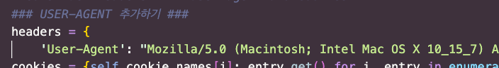
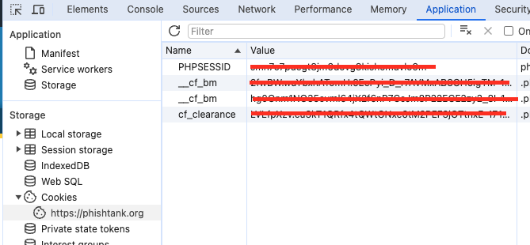
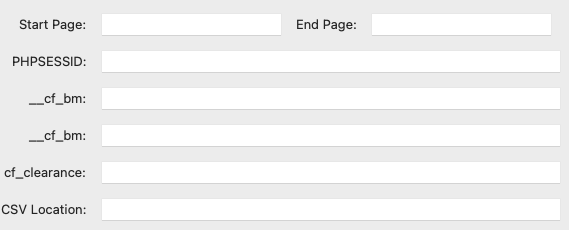

# phishingURL_CRAWLER

피싱 url 크롤링용 툴 개발 (from PhishTank.org)

## Anti-Tank (Crawling Tool)

## How-To-Use

1. User-Agent 확인 및 코드 수정
   
   https://m.avalon.co.kr/check.html
   > User-Agent를 확인하는 방법 중 가장 간단한 사이트

   

   **Anti-Tank.py** 코드의 **User-Agent**를 본인과 맞게 수정해준다.

2. 쿠키값 확인

    https://phishtank.org/phish_archive.php
   
   

   피시탱크의 쿠기값은 현재(24.04.11 기준) 30분마다 값이 Expiring 된다.

   > **!!!중요한 점!!!   
   그냥 사이트에서 쿠키값을 찾으면 안되고 게시물을 들어가서 확인해야한다.**

3. 페이지 ~ 쿠키값 입력 / 저장 위치 설정
   
   

## PS

쿠키값까지 자동으로 들어가면 좋았겠지만 ㅠ.ㅜ   
좀 과하다 생각해서 개발 마무리